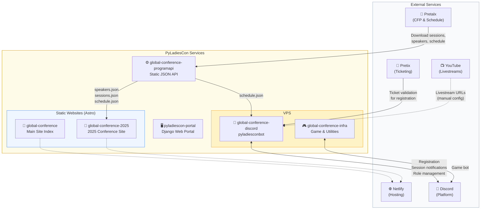

```mermaid
flowchart TB
    subgraph External["External Services"]
        Pretalx["🎤 Pretalx<br/>(CFP & Schedule)"]
        Pretix["🎫 Pretix<br/>(Ticketing)"]
        Discord["💬 Discord<br/>(Platform)"]
        YouTube["📺 YouTube<br/>(Livestreams)"]
        Netlify["🌐 Netlify<br/>(Hosting)"]
    end

    subgraph PyLadiesCon["PyLadiesCon Services"]
        subgraph Websites["Static Websites (Astro)"]
            MainSite["📄 global-conference<br/>Main Site Index"]
            Site2025["📄 global-conference-2025<br/>2025 Conference Site"]
        end

        ProgramAPI["⚙️ global-conference-programapi<br/>Static JSON API"]

        Portal["🖥️ pyladiescon-portal<br/>Django Web Portal"]

        subgraph VPS["VPS"]
            DiscordBot["🤖 global-conference-discord<br/>pyladiesconbot"]
            Infra["🎮 global-conference-infra<br/>Game & Utilities"]
        end
    end

    %% Program API flow
    Pretalx -->|"Download sessions,<br/>speakers, schedule"| ProgramAPI
    ProgramAPI -->|"speakers.json<br/>sessions.json<br/>schedule.json"| Site2025
    ProgramAPI -->|"schedule.json"| DiscordBot

    %% Discord Bot flow
    Pretix -->|"Ticket validation<br/>for registration"| DiscordBot
    DiscordBot <-->|"Registration<br/>Session notifications<br/>Role management"| Discord
    YouTube -.->|"Livestream URLs<br/>(manual config)"| DiscordBot

    %% Infrastructure game
    Infra <-->|"Game bot"| Discord

    %% Hosting
    MainSite -.-> Netlify
    Site2025 -.-> Netlify

    %% Links to repos
    click MainSite "https://github.com/pyladies/global-conference" _blank
    click Site2025 "https://github.com/pyladies/global-conference-2025" _blank
    click ProgramAPI "https://github.com/pyladies/global-conference-programapi" _blank
    click Portal "https://github.com/pyladies/pyladiescon-portal" _blank
    click DiscordBot "https://github.com/pyladies/global-conference-discord" _blank
    click Infra "https://github.com/pyladies/global-conference-infra" _blank

    %% Styling
    style External fill:#f8fafc,stroke:#94a3b8
    style PyLadiesCon fill:#fefce8,stroke:#ca8a04
    style Websites fill:#eff6ff,stroke:#3b82f6
    style VPS fill:#fef3c7,stroke:#f59e0b
```
